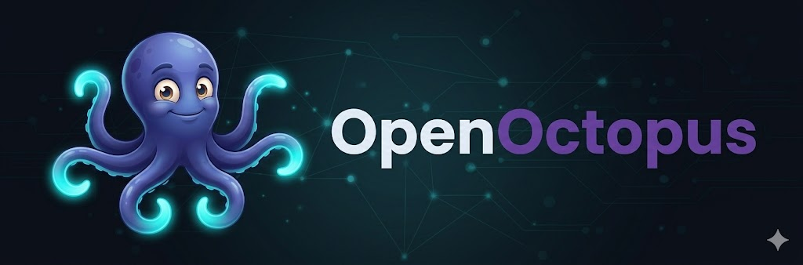
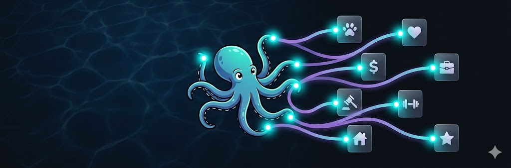
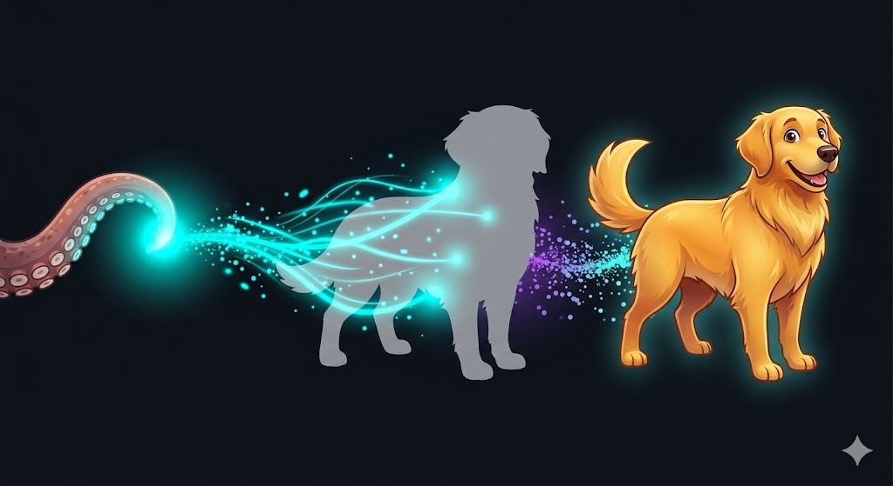
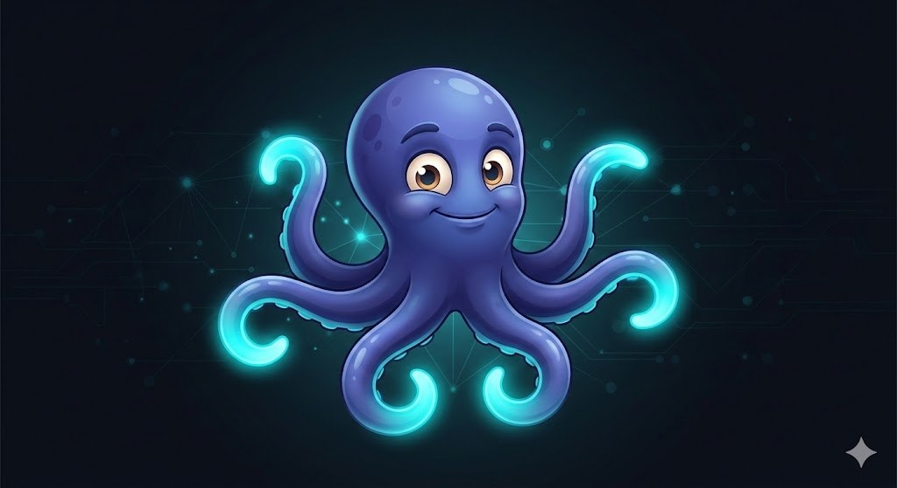

<p align="center">
  <picture>
    <source media="(prefers-color-scheme: light)" srcset="docs/assets/openoctopus-logo-text-dark.png">
    
  </picture>
</p>

<h3 align="center">SUMMON!</h3>

<p align="center">
  <a href="https://github.com/open-octopus/openoctopus/actions"></a>
  <a href="https://github.com/open-octopus/openoctopus/releases"></a>
  <a href="https://discord.gg/openoctopus"></a>
  <a href="LICENSE"></a>
</p>

<p align="center">
  Realm-native life agent system.<br>
  Organize life by realms. Summon anything into a living agent.
</p>

<p align="center">
  <a href="docs/project-spec.md">Spec</a> · <a href="docs/design-discussion.md">Design</a> · <a href="docs/branding.md">Brand</a> · <a href="docs/research/README.md">Research</a> · <a href="https://discord.gg/openoctopus">Discord</a>
</p>

---

OpenOctopus is not another unified chatbox. It organizes your life into **Realms** — pet, parents, finance, work, legal, hobbies — each with its own knowledge base, agent team, and skill set. Like an octopus, each tentacle has its own nerve center and acts autonomously, while the central brain coordinates everything.

What makes it unique: **Summon**. Turn any real-world object — your dog, your mom, your car — into a living AI agent with memory, personality, and proactive behavior.

<p align="center">
  
</p>

## Highlights

- **[Realm Matrix](#realm-matrix)** — grid dashboard of all life realms, health scores, risks, and to-dos at a glance
- **[Summon](#summon)** — turn any entity (pet, person, asset) into an AI agent that remembers, speaks, and acts
- **[Cross-Realm Intelligence](#architecture)** — knowledge graph connects all realms; your pet realm knows your finance budget
- **[Dual-layer Skills](#architecture)** — global skills (search, calendar, email) + realm skills (vet lookup, tax calc, law search)
- **[Agent Teams](#agent-teams)** — professional agents + summoned agents collaborate within each realm
- **[RealmHub](#realmhub)** — install pre-built realm packages ("Legal Advisor Team", "Pet Care") in one click
- **[Governance](#governance)** — human-in-the-loop approval, full audit log, privacy and permission tiers
- **[Local-first](#tech-stack)** — SQLite by default, optional cloud sync via PostgreSQL / Supabase

## Realm Matrix

Your life, organized as a grid. Each Realm is an independent domain:

| Realm | What lives inside | Example agents |
|---|---|---|
| `pet` | Pets, vets, food records | Health advisor, **Momo** (summoned) |
| `parents` | Parents, health files | Care assistant, **Mom** (summoned) |
| `partner` | Partner, anniversaries | Relationship advisor |
| `finance` | Accounts, investments, debts | Budget planner, tax assistant |
| `work` | Projects, colleagues, goals | Task manager, weekly reporter |
| `legal` | Contracts, cases, statutes | Contract lawyer, labor law advisor |
| `vehicle` | Car, insurance, maintenance | Maintenance tracker, cost reporter |
| `home` | House, appliances, repairs | Home manager |
| `health` | Check-ups, prescriptions | Health monitor |
| `fitness` | Training plans, body data | Fitness coach |
| `hobby` | Projects, learning materials | Learning coach |
| `friends` | Social circle, events | Social radar |

Create, merge, or delete realms freely. The above are starter templates.

## Summon

The killer feature. Turn data into a living agent.

<p align="center">
  
</p>

```
Raw data → Structured Entity → SUMMON → Agent with memory, personality & initiative
```

| Entity type | Examples | After summoning |
|---|---|---|
| **Living** | Pet, family, friend | Simulated dialogue, personality, emotional expression |
| **Asset** | Car, house, portfolio | Status monitoring, maintenance alerts, cost reports |
| **Organization** | Company, hospital | Process guides, contact management |
| **Abstract** | Goal, project, habit | Progress tracking, deviation alerts, retrospectives |

**What a summoned agent can do:**

```
You:  "I'm traveling for 5 days next week."

Momo (Pet):     "Who's going to feed me and walk me for 5 days?!"
Mom (Parents):  "Mom just said she'd like to visit — she could take care of Momo."
Car (Vehicle):  "Charge to full before departure? Or take a taxi to the airport?"
Budget (Finance): "Trip budget estimate: ¥X. Remember to save receipts."

→ System compiles a "Trip Prep Checklist" for your approval.
```

## Agent Teams

Three types of agents, two layers:

```
Central Agents (global)
  · Router — intent detection & realm routing
  · Coordinator — cross-realm analysis
  · Scheduler — proactive triggers & cron

Realm Agents (per-realm)
  · Professional — legal advisor, budget planner, health monitor
  · Summoned ✦ — Momo, Mom, my Tesla (entities brought to life)
```

## RealmHub

Like an app store, but for life domains. Install a complete realm package:

- **Legal Advisor Team** — entity templates (lawyer, contract, statute) + 3 agents + skills
- **Pet Care** — pet profile + health advisor + vet lookup + vaccination tracker
- **Family Finance** — accounts + budget planner + investment analyzer

Each package includes: realm template, entity templates, agent configs, skill configs, sample data.

## Architecture

```
  CLI / Web Dashboard / Mobile
               │
               ▼
┌──────────────────────────────────────────────┐
│            OpenOctopus Core (Brain)           │
│                                              │
│  Router Agent · Coordinator · Scheduler      │
│  Knowledge Graph (cross-realm entity links)  │
│  Global Skills (search·calendar·email·i18n)  │
└──────┬──────────┬──────────┬──────────┬──────┘
       │          │          │          │
  ┌────▼───┐ ┌───▼────┐ ┌───▼────┐ ┌───▼────┐
  │  Pet   │ │Finance │ │ Legal  │ │Parents │  ...
  │ Realm  │ │ Realm  │ │ Realm  │ │ Realm  │
  │        │ │        │ │        │ │        │
  │ Agents │ │ Agents │ │ Agents │ │ Agents │
  │ Skills │ │ Skills │ │ Skills │ │ Skills │
  │ Memory │ │ Memory │ │ Memory │ │ Memory │
  └────────┘ └────────┘ └────────┘ └────────┘

  ✦ Summoned agents live inside their realm.
  ↔ Knowledge graph links entities across realms.
```

## Governance

Every agent action follows the trust chain:

- **Human-in-the-loop** — critical actions require explicit approval
- **Audit log** — full trace of every agent decision, evidence, and outcome
- **Privacy tiers** — per-realm permission control, data isolation between realms
- **Budget limits** — token and cost caps per agent, per realm, per action

## Tech Stack

| Layer | Choice |
|---|---|
| Runtime | Node.js >= 22 + TypeScript |
| Gateway | Unified orchestration (ref: OpenClaw Gateway) |
| Client | Web Dashboard (Realm Matrix) + CLI (`tentacle`) |
| Data | SQLite (local-first) + PostgreSQL / Supabase (optional sync) |
| Vector | pgvector / local vector store (per-realm sharding) |
| Plugin | Global Skill + Realm Skill + Realm Package spec |

## Docs

| Doc | What's inside |
|---|---|
| **[Project Spec](docs/project-spec.md)** | Naming, RealmHub, information architecture, milestones |
| **[Design Deep Dive](docs/design-discussion.md)** | Realm naming, Summon mechanism, layered architecture, cross-realm coordination |
| **[Brand Guide](docs/branding.md)** | Taglines, colors, mascot Octo, logo prompts, ecosystem naming |
| **[Research Index](docs/research/README.md)** | AI Native signals, scenario mapping, competitive landscape, agent frameworks |

## Ecosystem

| Component | Name | Metaphor |
|---|---|---|
| Realm marketplace | **RealmHub** | Realm package hub |
| CLI | **tentacle** | Tentacle = reach & touch |
| Agent gateway | **ink** | Ink = information flow |
| Summon engine | **summon** | Core feature |
| Community | **The Reef** | Coral reef = habitat |
| Realm config | **REALM.md** | Realm definition |
| Entity persona | **SOUL.md** | Summoned agent personality |

## Octo



The mascot. A deep-sea octopus named **Octo** — calm, multi-threaded, quietly brilliant. Eight arms juggling your entire life while one brain keeps it all in sync. The tentacle tips glow cyan when summoning entities to life.

*"A deep-sea octopus, definitely."*

<br clear="right">

## License

MIT
